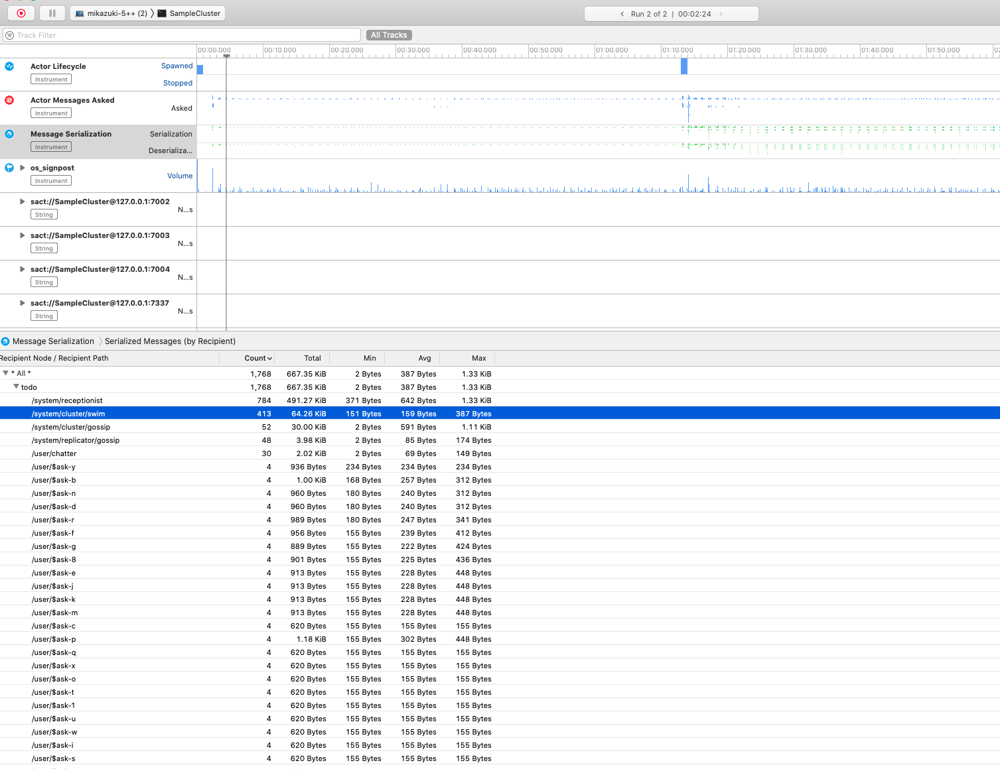

# Actor Instruments

These projects allow for the type-safe creation of Custom Instruments(.app) instruments.

A number of pre-defined instruments are available and it is possible to re-use them, 
customize them and build actor-specific instruments specialized for your Distributed Actors application!

Use case examples:

- measuring duration of ask (request/reply) interactions,
- measuring timing and details around spawned / stopped actors,
- measuring impact (detailed timing, size of payloads) of serialzied messages
- measuring utilizaiton of receptionist (how many keys are used, how many times they are queries, how large listings are when queried,
- measuring specifics around CRDT data types, which types are used, how large they are, where they are sent,
- and more...

## Requirements

Instruments is only available on Apple platforms.

However we think it is very useful even for developing server-side Linux systems during development time on a local Mac,
as their visualizations help understand more about how the actor system is functioning and therefore build better intuition about it.

## Screenshots (may be not super up to date)

