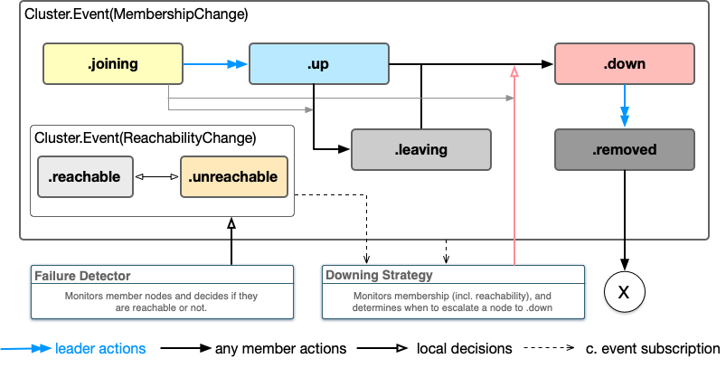

# Clustering

Clustering multiple actor system instances into a single Distributed Actor System.

## Overview

In this article, we'll learn how to configure and use multiple ``ClusterSystem`` instances to form a distributed system.

## Initializing a ClusterSystem

In this section, we will discuss initializing and using a distributed cluster system.

First, import the `Distributed` module to enable the capability to declare `distributed actor` types, 
and the `DistributedActors` module which is the main module of the cluster library which contains the `ClusterSystem` types.

```swift
import Distributed
import DistributedActors
```

Next, the first thing you need to do in your clustered applications is to create a `ClusterSystem`.
You can use the default `ClusterSystem()` initializer which defaults to a `"ClusterSystem"` system name and the default `127.0.0.1:7337` host/port:

```
let system = await ClusterSystem() // default 127.0.0.1:7337 bound actor system```
```

For more realistic uses, it is expected that you will configure your cluster system as you start it up, so here is how a typical `Main` struct of an server-side application might look like:

```swift
@main
struct Main {
    static func main() async throws {
        let system = await ClusterSystem("FirstSystem") { settings in
            settings.node.host = "127.0.0.1"
            settings.node.port = 7337
        }
        
        
        try await system.terminated
    }
}
```

The `try await system.terminated` will suspend the `main()` function until the cluster is shut down, by calling `shutdown()`.

Declaring a distributed actor is similar to declaring a plain `actor`. We do this by prepending the actor declaration

### Configuring TLS

TODO: documentation of TLS config

## Forming clusters

Forming a cluster is the first step towards making use of distributed clusters across multiple nodes.

Once a node joins at least one other node of an already established cluster, it will receive information about all other nodes
which participate in this cluster. This is why often it is not necessary to give all nodes the information about all other nodes in a cluster,
but only attempt to join one or a few o them. The first join "wins" and the cluster welcome the new node into the ``Cluster/Membership``.

### Joining existing nodes

In the simplest scenario we already about some existing node that we can join to form a cluster, or become part of a cluster that node already is in.

This is done using the system's ``ClusterControl`` object, like this:

```swift
system.cluster.join(node: Node(systemName: "JoiningExample", host: "127.0.0.1", port: 8228))
```

> Note: The difference between a ``Node`` and ``UniqueNode`` is that a ``Node`` is "some node on that address", while 
> an ``UniqueNode`` is a node that we have contacted and know its exact unique node identifier. Therefore, when reaching 
> out to a node we know nothing about just yet, we use the `Node` type. 

You can observe <doc:#Cluster-events> in order to see when a node has been successfully joined.

TODO: More async/await APIs will be nice here to await for joining a concrete node etc.

### Node discovery

The cluster system uses [swift-service-discovery](https://github.com/apple/swift-service-discovery) to discover nearby nodes it can connect to. This discovery step is only necessary to find IPs and ports on which we are expecting other cluster actor system instances to be running, the actual joining of the nodes is performed by the cluster itself. It can negotiate, and authenticate the other peer before establishing a connection with it (see also TODO: SECURITY).

As such, it is able to use any node discovery mechanism that has an implementation of the `ServiceDiscovery` protocol, like for example: [tuplestream/swift-k8s-service-discovery](https://github.com/tuplestream/swift-k8s-service-discovery) which implements discovery using the kubernetes (k8s) APIs.

#### Configuring service discovery

TODO

### Leadership

TODO: document leadership and Leadership changes.


## Cluster Membership

As nodes join and leave the cluster, the `cluster.membership`

## Cluster events

Cluster events are events emitted by the cluster as changes happen to the lifecycle of members of the cluster. 

Generally, one should not need to rely on the low-level clustering events emitted by the cluster and focus directly on <doc:Lifecycle> which expresses cluster lifecycle events in terms of emitting signals about an actor's termination. E.g. when a node an actor was known to be living on is declared as ``Cluster/MemberStatus/down`` "terminated" signals are generated for all actors watching this actor. This way, you don't usually have to think about specific nodes of a cluster, but rather focus only on the specific actor's lifecycles you care about and want to be notified about their termination.

Having that said, some actors (or other parts of your program) may be interested in the raw event stream offered by the cluster system. For example, one can implement a stability report by observing how frequently ``Cluster/ReachabilityChange`` events are emitted, or take it one level further and implement your own ``DowningStrategy`` based on observing those reachability changes.

Events emitted by the cluster, are always expressed in terms of cluster _members_ (``Cluster/Member``), which represent some concrete ``UniqueNode`` which is part of the membership. As soon as a node becomes part of the membership, even while it is only ``Cluster/MemberStatus/joining``, events about it will be emitted by the cluster.

A cluster member goes through the following phases in its lifecycle:




